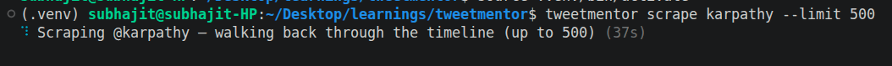
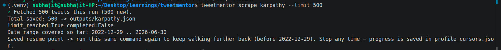
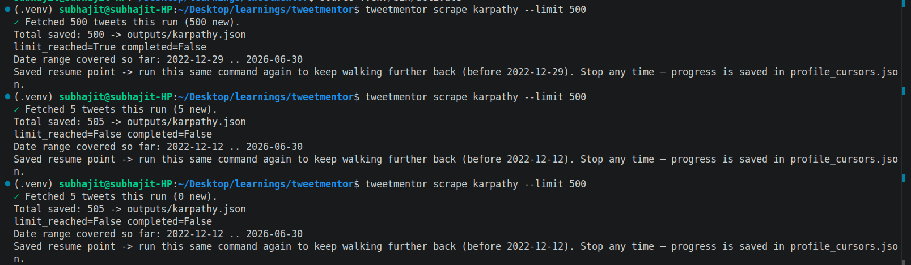
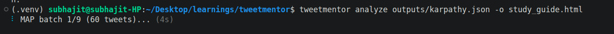
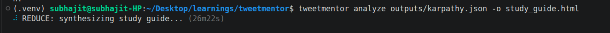
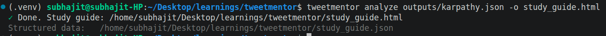

# tweetmentor

Scrape an X (Twitter) account's timeline and turn it into a study guide: concrete
patterns pulled from the person's posts, plus an action plan for following the
same path.

**Live example:** [dassubhajit99.github.io/tweetmentor/study_guide.html](https://dassubhajit99.github.io/tweetmentor/study_guide.html) — generated from [@karpathy](https://x.com/karpathy)'s timeline.

Three steps:

1. `scrape` — walk a public profile's timeline, resuming deeper on each run.
2. `analyze` — a map-reduce LLM pipeline finds patterns across a set of themes
   and writes them up as an HTML/JSON study guide.
3. `export` — flatten scraped JSON into CSV, if you want it.

The default themes are aimed at "how did this person become a developer"
(learning habits, backend work, AI, freelancing), but both the target account
and the themes are configurable.

> Scraping X may violate its Terms of Service and can get an account
> rate-limited or suspended. Only scrape public data, keep request rates low,
> and use an account you're okay risking. You're responsible for how you use
> this.

## Install

Requires Python 3.10+.

```bash
git clone https://github.com/dassubhajit99/tweetmentor.git
cd tweetmentor
python -m venv .venv && source .venv/bin/activate
pip install -e .
```

This installs the `tweetmentor` command.

## Configure

```bash
cp .env.example .env
# edit .env: LLM_API_KEY is required, LLM_BASE_URL and LLM_MODEL are optional
```

### X session cookies (for scraping)

Scraping authenticates as you, using your X session's `auth_token` cookie.

1. Log into your account at [x.com](https://x.com) in a browser.
2. Open DevTools (`F12`), go to Application → Storage → Cookies → `https://x.com`,
   and copy the value of the `auth_token` cookie.
3. Put it in a `cookies.json` file in the project root, in Scweet's format:

```json
[
  {
    "username": "your_handle",
    "cookies": { "auth_token": "PASTE_YOUR_TOKEN_HERE" }
  }
]
```

You can list more than one account to rotate between them, which helps with
rate limits:

```json
[
  { "username": "account_one", "cookies": { "auth_token": "..." } },
  { "username": "account_two", "cookies": { "auth_token": "..." } }
]
```

Your `auth_token` grants full access to the account it belongs to — treat it
like a password. Don't commit it or share it. If it leaks, log out of that X
session (or change your password) to invalidate it.

`cookies.json`, `.env`, `scweet_state.db` and `profile_cursors.json` are all
gitignored.

## Usage

```bash
# 1. Scrape one batch of tweets, oldest-first from wherever the last run
#    stopped. Output accumulates (deduped) in outputs/<username>.json
tweetmentor scrape karpathy --limit 500

# 2. Analyze, producing study_guide.html (and study_guide.json)
tweetmentor analyze outputs/karpathy.json -o study_guide.html

# 3. Optional: flatten any of the JSON files to CSV
tweetmentor export outputs/karpathy.json outputs/karpathy.csv
```

Full option list for each command: `tweetmentor <command> --help`.

## In action

See a full generated guide live: [study_guide.html](https://dassubhajit99.github.io/tweetmentor/study_guide.html) (from [@karpathy](https://x.com/karpathy)'s timeline).

`scrape` walks the timeline oldest-first, one page per run, and reports progress as it goes:




Running it again resumes deeper into the account's history instead of re-fetching what's already saved — here it's walked back from 500 → 505 tweets across a couple more runs:



`analyze` then runs a map-reduce pass over whatever's been scraped: mapping batches of tweets to per-theme observations, then reducing them into the final study guide:





### Re-running scrape

A single `scrape` run pulls one page of the timeline, not the whole thing.
Run the same command again to keep walking further back; each run resumes
from where the previous one left off (see [How resume works](#how-resume-works))
instead of re-fetching the newest tweets.

Each run prints the date range currently covered in
`outputs/<username>.json`, for example:

```
Total saved: 812 -> outputs/karpathy.json
Date range covered so far: 2019-03-02 .. 2024-11-18
Saved resume point -> run this same command again to keep walking further
back (before 2019-03-02). Stop any time — progress is saved in
profile_cursors.json.
```

A few things worth knowing:

- There's nothing to clean up between runs. Come back days later and it
  picks up from the saved cursor.
- `analyze` works on whatever's been scraped so far — you don't need the
  full timeline before running it, and you can re-run it later once you've
  scraped more.
- A run stops on its own (`completed=True`) once the timeline is exhausted
  or a daily quota is hit; the printed message says which.

### Custom themes

Pass a JSON file to analyze any account for any set of topics:

```json
[
  {
    "id": "growth",
    "desc": "How they grew an audience",
    "title": "Audience growth"
  },
  {
    "id": "writing",
    "desc": "How they write threads",
    "title": "Writing style"
  }
]
```

```bash
tweetmentor analyze outputs/someone.json --themes my_themes.json --person "@someone"
```

## How resume works

Scweet's built-in `resume=True` doesn't persist pagination for profile
timelines across separate runs, so plain runs just keep re-fetching the
newest tweets. tweetmentor works around this by driving the runner directly,
saving the `resume_cursors` it returns to `profile_cursors.json`, and passing
them back in on the next run.

## Running tests

```bash
pip install -e ".[test]"
pytest
```

Everything is mocked (Scweet, the LLM client, the filesystem via `tmp_path`),
so the suite needs no network access, cookies, or API key.

To run a single file or test:

```bash
pytest tests/test_scrape.py
pytest tests/test_scrape.py -k test_date_range_returns_oldest_and_newest
```

## Library use

```python
from tweetmentor import scrape_user, analyze_tweets, render_html
from tweetmentor.config import load_llm_config

scrape_user("karpathy", limit=500)
guide = analyze_tweets("outputs/karpathy.json", load_llm_config())
open("study_guide.html", "w").write(render_html(guide))
```

## License

MIT — see [LICENSE](LICENSE).
